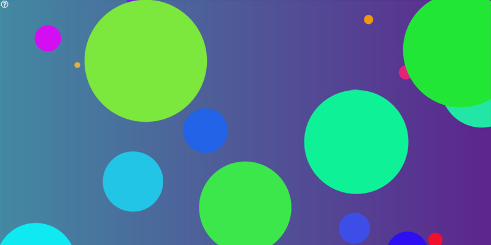

http://nick.oninepositioning.com/ColorTap/

This is an interactive audio/visual application that uses PaperJS for animations and Howler for audio.

Content available under MIT License via `jonobr1 <https://github.com/jonobr1/Neuronal-Synchrony>`_

